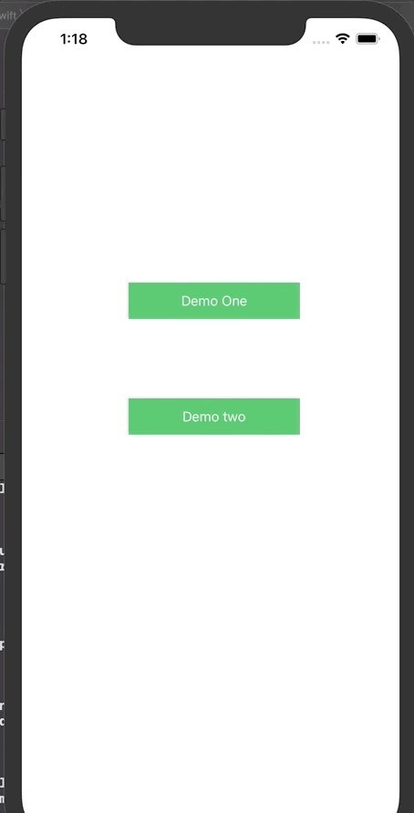

# Basis Card Demo Assignment
 Swipeable Card Views showing data from server
 
 ## Installation
 After taking a pull or downloading the zip, open it in xcode.
 Check the pod and you will find two pod there
 ```bash
 pod 'pod 'CardSlider'
 pod 'iCarousel'
 ```
 Setting up pod
  open the terminal at folder
 ```bash
 pod init
 pod install
 ```
 you're good to go now.
 
## Demo
Select ypur preferrable device then Buiild and run the current scheme.

After successfully launching you'll see an initial screen with button - Demo One and Demo Two.
Press any one of it. Press any one of it. 

## Demo One Visual Display


## Demo Two Visual Display


##Framework Used
CardSlider for sliding effect and scrolling through to different cards and modify some files to our need.
iCarousel for second Demo carsousel effect.


